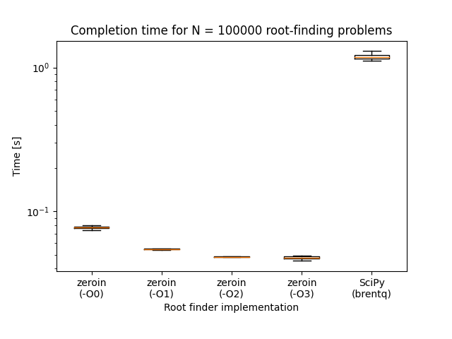

# Zerobench

Benchmark of `zeroin` for discussion at: https://fortran-lang.discourse.group/t/using-reserved-words-as-variables/6398/56



## Run

```
chmod +x launch.sh plot.py
./launch.sh && ./plot.py
```

## Files

- `root.f90` - Fortran wrapper modules and benchmark driver
- `timers.c` - Timers
- `launch.sh` - Bash script used to launch driver
- `plot.py` - Python 3 script for plotting
- `Makefile` - Makefile for compiling targets

The root solvers available are:
- `zeroin.f` from Forsythe, Malcolm, and Moler (1987)
- `dzero.f` from the PORT Mathematical Software Library
- `root.f` from the NAPACK Fortran library
- `brentq.c` from SciPy

Note an alternative version of `zeroin` from Brent can be found in the ["golden oldies"](https://netlib.org/go/index.html) folder on Netlib. 

## Acknowledgements

A few bits and pieces are borrowed from other places, including
- `d1mach` from https://degenerateconic.com/
- `urandom_seed` from https://cyber.dabamos.de/programming/modernfortran/random-numbers.html

Thanks also to Cleve Moler for documenting the history of `zeroin` in a series of blog posts:
- [Zeroin, Part 1: Dekker’s Algorithm](https://blogs.mathworks.com/cleve/2015/10/12/zeroin-part-1-dekkers-algorithm/?s_tid=blogs_rc_1)
- [Zeroin, Part 2: Brent’s Version](https://blogs.mathworks.com/cleve/2015/10/26/zeroin-part-2-brents-version/?s_tid=blogs_rc_1)
- [Zeroin, Part 3: MATLAB Zero Finder, FZERO](https://blogs.mathworks.com/cleve/2015/11/09/zeroin-part-3-matlab-zero-finder-fzero/?s_tid=blogs_rc_3)

Some interesting information on `zeroin` from Margaret Wright was shared in this [Twitter thread](https://twitter.com/walkingrandomly/status/1544607833802555392).

The original code from Richard P. Brent (both Algol and Fortran versions) can be found on the [authors webpage](https://maths-people.anu.edu.au/~brent/pub/pub011.html). See pg. 188 of this [PDF file](https://maths-people.anu.edu.au/~brent/pd/rpb011i.pdf), which contains a scan of the book Algorithms for Minimization without Derivatives (1973), Prentice-Hall. An unverified transcription can be found in `brent_zero.f`.
According to the source comments, the routines were tested with the FORTRAN H compiler an an [IBM 360/91](https://en.wikipedia.org/wiki/IBM_System/360_Model_91) computer. 

## Resources on reproducibility

- Lecture on Experiments and Data Presentation in High Performance Computing, Georg Hager NHR@FAU 2023: https://www.youtube.com/watch?v=y1n0IJZiPuw
- 12 Ways to Fool the Masses with Irreproducible Results, Lorena Barba IPDPS21 keynote: https://www.youtube.com/watch?v=R2-GuH-6VFU
- Lorena Barba (2023). Anti Patterns of Scientific Machine Learning to Fool the Masses:A Call for Open Science. https://lorenabarba.com/figshare/anti-patterns-of-scientific-machine-learning-to-fool-the-massesa-call-for-open-science/